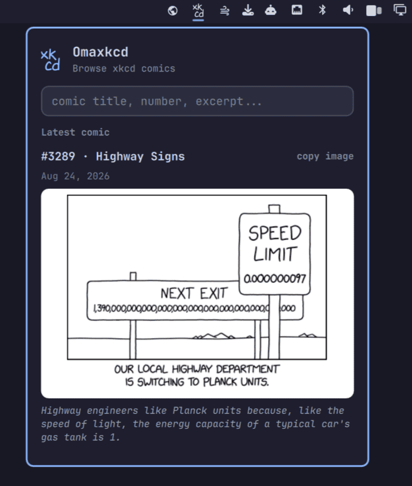

# Omaxkcd

Browse and search every xkcd comic from the [Omarchy](https://omarchy.org) bar — latest, by number, or full-text search over title, alt text, and transcript.



## Install

```bash
omarchy plugin add https://github.com/cossssmin/omarchy-xkcd.git --enable
```

## Usage

Click the `xk/cd` icon in the bar (or use the panel keybindings):

- Empty query shows the latest comic
- Type a number to jump to that comic
- Type anything else to full-text search titles, alt text, and transcripts
- `↑`/`↓` move through results, `Enter` opens the comic on xkcd.com
- Click the comic image to open it on xkcd.com, or `copy image` to copy it to the clipboard

## Remove

```bash
omarchy plugin remove cossssmin.xkcd
```

## Credits

- Comics by [xkcd](https://xkcd.com) (Randall Munroe), [CC BY-NC 2.5](https://xkcd.com/license.html)
- Icon uses the [xkcd Script font](https://github.com/ipython/xkcd-font), CC BY-NC 3.0

## License

MIT (plugin code). The bundled `xkcd-script.ttf` font is CC BY-NC 3.0.
