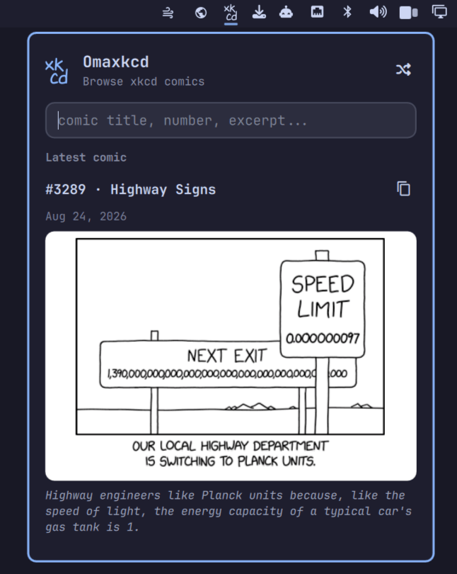

# Omaxkcd

Browse and search every xkcd comic from the [Omarchy](https://omarchy.org) bar - latest, by number, random, or full-text search over title, alt text, and transcript.



## Features

- Shows the latest comic when opened
- Jump to any comic by number
- Full-text search over titles, alt text, and transcripts
- Shuffle button for a random comic
- Copy the comic image to the clipboard
- Click through to the comic on xkcd.com
- Follows your Omarchy theme (colors, fonts, spacing)

## Install

```bash
omarchy plugin add https://github.com/cossssmin/omarchy-xkcd.git --enable
```

The widget lands in the bar's right section by default.

## Usage

Click the `xk/cd` icon in the bar:

- Empty query shows the latest comic
- Type a number to jump to that comic
- Type anything else to full-text search titles, alt text, and transcripts
- `↑`/`↓` move through results, `Enter` opens the comic on xkcd.com
- Click the comic title or image to open it on xkcd.com
- The shuffle button (top right) picks a random comic
- The copy button next to the comic title copies the image to the clipboard
- `Escape` closes the panel

## Configuration

Nothing to configure :) Colors, fonts, and spacing follow your Omarchy theme automatically.

## Dependencies

Everything below ships with a stock Omarchy install:

- `curl` - fetches comic images
- `wl-clipboard` (`wl-copy`) - copies images to the clipboard
- `xdg-open` - opens comics in your browser

Comic data comes from the public [xkcd search API](https://api.xkcdsearch.workers.dev) (mirrors xkcd's own JSON and adds full-text search). Images are only ever loaded from `imgs.xkcd.com` over HTTPS.

## Remove

```bash
omarchy plugin remove cossssmin.xkcd
```

## Credits

- Comics by [xkcd](https://xkcd.com) (Randall Munroe), [CC BY-NC 2.5](https://xkcd.com/license.html)
- Icon uses the [xkcd Script font](https://github.com/ipython/xkcd-font), CC BY-NC 3.0

## License

MIT (plugin code). The bundled `xkcd-script.ttf` font is CC BY-NC 3.0.
